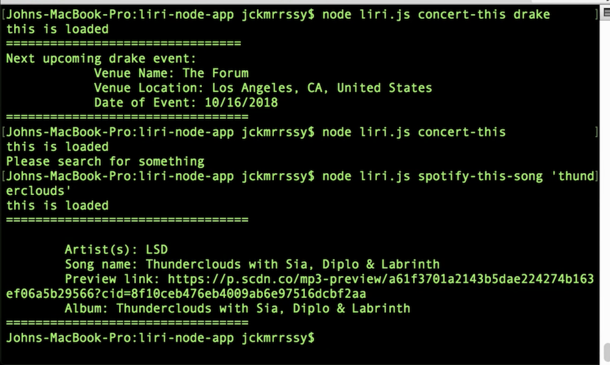

# Liri

## Watch a demo [here](https://drive.google.com/file/d/1tj05p-V68LGbbYE8P2s1lppTng5lPh9f/view)



## What it is
This Node.js command line application called Liri uses various node packages to make API requests. Users are able search for songs, movies and upcoming band performances and will receive back information about their given search term. Specifically, it requests information from the Bands in Town, Spotify and OMDB API's.

## Why it's useful
This is a quick and easy way to find an upcoming concert of your favorite artist, find out more about that song you heard on the radio, and learn some good movie trivia. 

## Installing
To run Liri, you will first need to clone the repository to your local machine. 

HTTPS:
```
$ git clone https://github.com/jckmrrssy/liri-node-app.git
````
SSH:
````
$ git clone git@github.com:jckmrrssy/liri-node-app.git
````

You will need to add an .env file at the root of the app containing your Spotify API keys. For help getting your own API keys visit:
```
https://developer.spotify.com/documentation/web-api/
````
Once you have your keys, add the following lines of code to your .env file:
````
SPOTIFY_ID=<your spotify id here>
SPOTIFY_SECRET=<your spotify secret here>
````
You will then be able to run the app with the command line commands below. 

## How it works
There are four different ways this app can be used.

Return the next upcoming concert for the searched for artist or band:
````
$ node liri.js concert-this <search artist/band name here>
````
Return information about the searched for movie:
````
$ node liri.js movie-this <search movie name here> 
````
Return information about the searched for song:
````
$ node liri.js spotify-this-song <search song name here> 
````
This will read the included random.txt file and pass through a value to the spotify function, which will run and return song information about the song in the txt file:
````
$ node liri.js do-what-it-says 
````

## Authors
See contribution history [here](https://github.com/jckmrrssy/liri-node-app/graphs/contributors)

